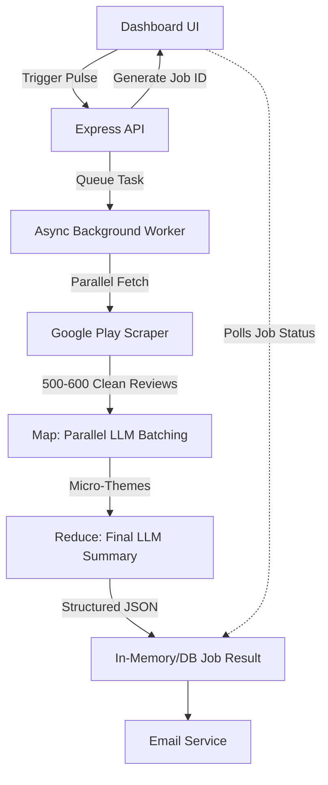

# 📈 Groww App Review Pulse: Optimized High-Throughput Architecture

## 📋 Project Overview
A weekly automated insights tool for the **Groww** application. It fetches recent reviews (500-600 at a time) from the App Store and Play Store, sanitizes them, and uses **Groq (Llama 3)** to distill them into a scannable, one-page "Weekly Pulse" containing top themes, user quotes, and actionable product ideas. 

This optimized architecture is designed to handle **large volumes (500-600+ reviews)** while minimizing **latency** and maximizing **throughput** through Map-Reduce LLM processing and background queues.

---

## 🏗️ Core Architecture Components

### 1. High-Throughput Data Ingestion (Phase 1)
- **Parallel Scraping**: Fetch 300-400 reviews concurrently across different sort algorithms (e.g., NEWEST, HELPFULNESS) to easily gather 500-600 unique reviews.
- **Deduplication & Sanitization**: Fast, in-memory deduplication and PII scrubbing (Regex-based removal of usernames/emails/phone numbers).

### 2. Map-Reduce LLM Engine: Groq (Phase 2)
- To bypass token limits and optimize latency, review processing is split:
  - **Map Step (Parallel)**: Reviews are chunked into batches (e.g., 100 reviews per batch). Each batch is sent in *parallel* to Groq (Llama 3) to extract micro-themes and quotes.
  - **Reduce Step**: A central LLM call aggregates the parallel batch results into the final maximum 5 themes, 3 top user quotes, and 3 action items.
- **Word Count**: Final output strictly limited to ≤250 words per report.

### 3. Asynchronous Task Queue / Job Management (Phase 3)
- **Avoid Blocking**: The main API endpoint does not wait for scraping, LLM, and emailing to finish. Instead, it creates a "Job" and returns a `jobId` immediately.
- **Worker Process**: Background jobs process the heavy lifting (Scrape -> Map -> Reduce -> Email) to ensure the API Server throughput remains high.
- **Client Polling/SSE**: The frontend checks the job status via Polling or Server-Sent Events, achieving a non-blocking UI experience.

### 4. Premium Dashboard & Email Delivery (Phase 4)
- **UI Framework**: Vite + React with Premium Vanilla CSS (Glassmorphism, High Contrast, Dark Mode).
- **Communication Layer**: Email automation triggered asynchronously at the end of the Job pipeline.

---

## 🛠️ Tech Stack
-   **Frontend**: Vite, React, Vanilla CSS.
-   **Backend/Edge**: Node.js, Express.
-   **Task Queue**: Native Node-based Job Map / queue (or BullMQ/Redis for production).
-   **Review Scraping**: `google-play-scraper`.
-   **LLM Inference**: Groq (Llama 3).

---

## 🔄 Data Flow Sequence

---

## 📅 Phase-wise Implementation Strategy

### Phase 1: High-Throughput Scraper Updates
- Increase review fetch limits in `reviewFetcher.js` to target ~600 reviews.
- Optimize deduplication to handle larger arrays efficiently.

### Phase 2: Map-Reduce LLM Pipeline
- Implement chunking logic (e.g., 5 chunks of 100-120 reviews).
- Use `Promise.all` to query Groq in parallel for mapping.
- Implement the reducer prompt to combine mapped insights.

### Phase 3: Asynchronous Queuing & Background Execution
- Convert the synchronous `/api/generate` Express route into an asynchronous Job manager.
- Implement `POST /api/jobs` (start job) and `GET /api/jobs/:id` (check status).

### Phase 4: Frontend Polling & Resilience
- Update React Dashboard to poll `GET /api/jobs/:id`.
- Add loading states indicating current backend progress (e.g., "Scraping...", "Analyzing Reviews...", "Generating Report...").

---

## ⚠️ Key Constraints & Rules
- **Latency**: Parallelize LLM calls (Map phase) to ensure the entire pipeline completes within 10-15 seconds.
- **Word Limit**: The final generated note MUST be under 250 words.
- **Constraints**: 5 Themes maximum, 3 quotes, 3 ideas. No PII.
